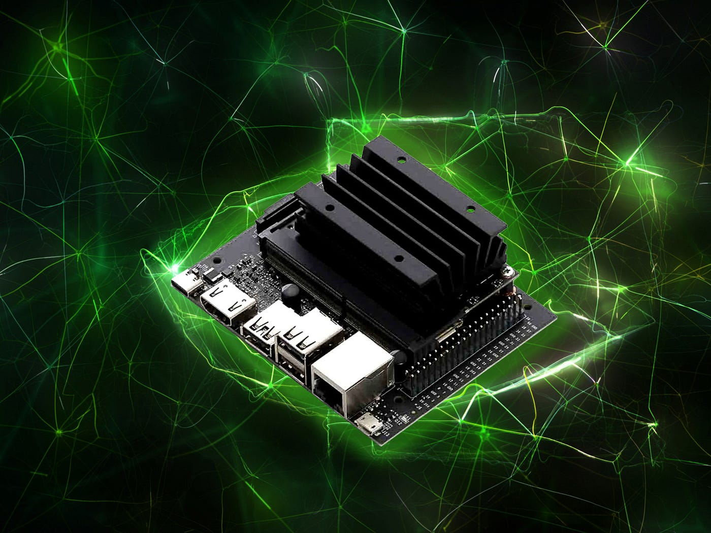

# SW_ObjectTracker
> Skunk Works Object Tracker - OT


This OT application:
* runs on the NVidia Jetson Orin utilizing the camera to detect people
* assigns each person a unique ID
* sends that ID with X Y coordinates to AOS app



## Development setup

The NVidia Jetson Orin development environment is setup to utilize prebuilt docker containers.
Jetson Inference is required to run these prebuilt containers.

Install with these instructions at this link:

[Running the Docker Container: Launching the Container](https://github.com/dusty-nv/jetson-inference/blob/master/docs/aux-docker.md)

```sh
$ git clone --recursive --depth=1 https://github.com/dusty-nv/jetson-inference
$ cd jetson-inference
$ docker/run.sh
```

**NOTE:**  It takes a VERY long time to run the initial applications due to downloading libraries and content. Therefore, run a few of the examples to cache some of these elements and make future runs quicker:

```sh
$ cd ~/Documents/jetson-inference
$ docker/run.sh -v
$ cd build/aarch64/bin
$ ./video-viewer /dev/video0
$ ./imagenet images/jellyfish.jpg images/test/jellyfish.jpg
```

## File Descriptions

| File | Description |
| ----------- | ----------- |
| udp_server.cpp | Server implementation to be mimiced in the AOS app | 
| object_tracking.py | Jetson Inference application - object tracking and sending ID, X, Y coordinates sent via sockets to udp_server | 


## Usage example

Command Line Options can be viewed by running:

```sh
$ cd ~/Documents/jetson-inference
$ docker/run.sh -v ~/skunkworks/:/my-object-tracking
$ python3 /my-object-tracking/object_tracking.py --help
```

You can hide the camera stream by passing the argument -hc (by default the camera stream will be displayed)
```sh
$ python3 /my-object-tracking/object_tracking.py -hc
```

Execute the following commands to get the Object Tracking application running. This requires 2 terminals.

Terminal 1 to run the UDP server:

```sh
$ cd ~/skunkworks
$ g++ udp_server.cpp -o udp_server
$ ./udp_server
```

Terminal 2 to run the Jetson application:

```sh
$ cd ~/Documents/jetson-inference
$ docker/run.sh -v ~/skunkworks/:/my-object-tracking
$ python3 /my-object-tracking/object_tracking.py
```


## Release History

* 0.1.2
    * CHANGE: added support to send UDP sockets with ID, x, y coordinates to the udp_server.cpp application which should prove useful for the AOS app
    * g++ udp_server.cpp -o udp_server
    * ./udp_server
    * then execute OT application as noted above (from container)
    * housekeeping: removed unused files I developed for IPC mkfifo - now using UDP to udp_server app (AOS)
* 0.1.1
    * CHANGE: Changed from IPC/mkfifo to a non blocking socket using UDP, 
    * Note that this requires **server.py** to be up and running but this server does not need to be running in container
* 0.1.0
    * CHANGE: Initial implementation
